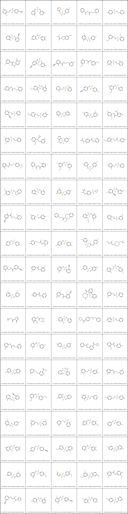

# ADMET 候选分子筛选项目

本项目使用 **ADMET-AI** 对 100 个全新生成的类药分子进行药代动力学和毒性性质预测。

## 预测结果概览

完整 104 项属性见 [random_100_admet_results.csv](random_100_admet_results.csv)。

|   ID | SMILES                                       |   molecular_weight |   logP |   QED |   hERG |   AMES |   DILI |   Caco2_Wang |
|-----:|:---------------------------------------------|-------------------:|-------:|------:|-------:|-------:|-------:|-------------:|
|    1 | N#Cc1ccc(S(=O)(=O)NCc2cc(F)ccc2O)cc1         |             306.32 |   1.88 |  0.9  |   0.24 |   0.16 |   0.82 |        -4.75 |
|    2 | Cc1cncc(NS(=O)(=O)Nc2cncc(C)c2)c1            |             278.34 |   1.86 |  0.89 |   0.38 |   0.01 |   0.92 |        -5.34 |
|    3 | O=S(=O)(Cc1ccco1)Nc1ccc(Br)cc1               |             316.18 |   2.98 |  0.94 |   0.42 |   0.09 |   0.78 |        -4.62 |
|    4 | O=C(COc1ccccc1)NC(=O)c1ccccc1F               |             273.26 |   2.16 |  0.93 |   0.17 |   0.1  |   0.91 |        -4.4  |
|    5 | O=S(=O)(NCc1ccccn1)c1ccc(F)cc1               |             266.3  |   1.7  |  0.92 |   0.13 |   0.1  |   0.82 |        -4.54 |
|    6 | Cc1ccccc1S(=O)(=O)Nc1ccccc1C#N               |             272.33 |   2.67 |  0.93 |   0.32 |   0.03 |   0.89 |        -4.61 |
|    7 | Cc1ccc(S(=O)(=O)Nc2ccc(F)cc2C)cc1F           |             297.33 |   3.38 |  0.94 |   0.47 |   0.02 |   0.83 |        -4.55 |
|    8 | CC(C)C(=O)N1Cc2ccc(N)cc2C1                   |             204.27 |   1.77 |  0.71 |   0.38 |   0.63 |   0.45 |        -4.31 |
|    9 | Cc1ccc(F)cc1NS(=O)(=O)c1ccc(F)cc1            |             283.3  |   3.07 |  0.94 |   0.38 |   0.01 |   0.8  |        -4.5  |
|   10 | COc1cccc(CNS(=O)(=O)c2ccccc2OC)c1            |             307.37 |   2.18 |  0.89 |   0.63 |   0.27 |   0.76 |        -4.62 |
|   11 | Cc1cccc(C(=O)NC(C)c2ccn(C)c(=O)c2)c1         |             270.33 |   2.18 |  0.93 |   0.23 |   0.05 |   0.7  |        -4.63 |
|   12 | COc1cc(C#N)ccc1NS(=O)(=O)Cc1cccc(C)c1        |             316.38 |   2.82 |  0.92 |   0.61 |   0.17 |   0.85 |        -4.7  |
|   13 | Cc1c(C#N)cccc1C(=O)NCCc1cccc(Cl)c1           |             298.77 |   3.49 |  0.94 |   0.6  |   0.15 |   0.73 |        -4.44 |
|   14 | COc1cccc(CC(=O)Nc2cccc(OC)c2)c1              |             271.32 |   2.89 |  0.91 |   0.73 |   0.31 |   0.75 |        -4.58 |
|   15 | O=S(=O)(NCc1ccccc1F)c1cccc(F)c1Cl            |             317.74 |   3.1  |  0.94 |   0.48 |   0.18 |   0.77 |        -4.37 |
|   16 | Cc1ccc(NC(=O)COc2ccccc2Cl)c(F)c1             |             293.73 |   3.81 |  0.93 |   0.47 |   0.14 |   0.82 |        -4.51 |
|   17 | COc1ccc(S(=O)(=O)Nc2ccccc2C)c(OC)c1          |             307.37 |   2.81 |  0.92 |   0.62 |   0.03 |   0.82 |        -4.72 |
|   18 | Cc1ccncc1CNS(=O)(=O)c1ccccc1Cl               |             296.78 |   2.52 |  0.94 |   0.48 |   0.07 |   0.83 |        -4.65 |
|   19 | N#Cc1ccc(NS(=O)(=O)c2ccc(Br)cc2)cc1          |             337.2  |   3.12 |  0.94 |   0.24 |   0.01 |   0.95 |        -4.69 |
|   20 | COc1cc(F)cc(NS(=O)(=O)c2ccccc2)c1            |             281.31 |   2.64 |  0.94 |   0.38 |   0.01 |   0.83 |        -4.63 |
|   21 | N#Cc1ccccc1CNS(=O)(=O)c1ccncc1               |             273.32 |   1.43 |  0.91 |   0.28 |   0.05 |   0.84 |        -4.66 |
|   22 | CCc1ccc(CNS(=O)(=O)c2ccc(F)c(F)c2)c(F)c1     |             329.34 |   3.14 |  0.92 |   0.64 |   0.23 |   0.75 |        -4.45 |
|   23 | O=S(=O)(Nc1cc(F)ccc1F)c1ccccc1F              |             287.26 |   2.9  |  0.94 |   0.34 |   0.02 |   0.83 |        -4.38 |
|   24 | O=S(=O)(Nc1cccc(Cl)c1)c1ccc(Cl)cc1Cl         |             336.63 |   4.45 |  0.9  |   0.52 |   0.01 |   0.87 |        -4.78 |
|   25 | COc1ccc(C)cc1NC(=O)c1ccc(C)cc1N(C)C          |             298.39 |   3.63 |  0.94 |   0.85 |   0.5  |   0.81 |        -4.73 |
|   26 | O=S(=O)(NCc1cccnc1)c1cc(F)cc(Cl)c1           |             300.74 |   2.35 |  0.94 |   0.32 |   0.04 |   0.84 |        -4.52 |
|   27 | CCc1ccccc1C(Nc1cccc(C)c1)C1CC1               |             265.4  |   5.12 |  0.79 |   0.87 |   0.22 |   0.24 |        -4.87 |
|   28 | CC(NS(=O)(=O)c1ccc(Cl)cc1F)c1occc1F          |             321.73 |   3.25 |  0.94 |   0.41 |   0.07 |   0.83 |        -4.39 |
|   29 | CC(=O)Nc1ccc(C(=O)Nc2ccccc2)cc1              |             254.29 |   2.9  |  0.88 |   0.25 |   0.16 |   0.9  |        -4.67 |
|   30 | COc1ccc(CNC(=O)Cc2ccc(Cl)cc2)c(Cl)c1         |             324.21 |   3.86 |  0.91 |   0.78 |   0.22 |   0.59 |        -4.65 |
|   31 | Cc1ccccc1NC(=O)COc1ccc(S(C)(=O)=O)cc1        |             319.38 |   2.42 |  0.92 |   0.28 |   0.06 |   0.92 |        -4.51 |
|   32 | O=C(NC(=O)c1ccccc1Cl)c1ccccc1F               |             277.68 |   3.05 |  0.86 |   0.13 |   0.12 |   0.93 |        -4.39 |
|   33 | COc1cc(Cl)cc(NS(=O)(=O)c2cc(Cl)ccc2F)c1      |             350.2  |   3.94 |  0.91 |   0.62 |   0.01 |   0.88 |        -4.72 |
|   34 | O=S(=O)(Cc1ccc(Cl)cc1)Nc1cccc(F)c1           |             299.75 |   3.42 |  0.94 |   0.7  |   0.13 |   0.7  |        -4.54 |
|   35 | Cc1cc(F)ccc1CNS(=O)(=O)c1cccnc1              |             280.32 |   2.01 |  0.93 |   0.44 |   0.09 |   0.74 |        -4.57 |
|   36 | COc1cc(S(=O)(=O)NC2CCc3cccnc32)ccc1C         |             318.4  |   2.36 |  0.94 |   0.44 |   0.18 |   0.83 |        -4.87 |
|   37 | Cc1ccccc1S(=O)(=O)Nc1ccccc1F                 |             265.31 |   2.93 |  0.93 |   0.32 |   0.02 |   0.82 |        -4.56 |
|   38 | Cc1cc(C)cc(S(=O)(=O)Nc2ccc(Cl)cc2)c1         |             295.79 |   3.76 |  0.94 |   0.51 |   0.01 |   0.83 |        -4.93 |
|   39 | CC(Nc1ccc(S(=O)(=O)N2CCC2)cc1)C(C)(C)C       |             296.44 |   2.93 |  0.93 |   0.79 |   0.19 |   0.39 |        -4.55 |
|   40 | N#Cc1cc(Cl)ccc1S(=O)(=O)Nc1cccc(Cl)c1        |             327.19 |   3.67 |  0.93 |   0.48 |   0.01 |   0.9  |        -4.64 |
|   41 | N#Cc1ccc(F)c(C(=O)NCCc2ccccc2Br)c1           |             347.19 |   3.43 |  0.92 |   0.51 |   0.18 |   0.77 |        -4.37 |
|   42 | O=S(Nc1ccc(Cl)cc1)c1cc(Cl)ccc1F              |             304.17 |   4.27 |  0.9  |   0.48 |   0.04 |   0.69 |        -4.63 |
|   43 | CCC1Cc2ccccc2CCN1C(=O)OCc1ccccc1             |             309.41 |   4.2  |  0.85 |   0.6  |   0.07 |   0.51 |        -4.59 |
|   44 | CCOc1ccccc1S(=O)(=O)Nc1cc(Cl)ccc1C           |             325.82 |   3.85 |  0.91 |   0.63 |   0.02 |   0.81 |        -4.66 |
|   45 | Cc1ncccc1CNS(=O)(=O)c1cccc(Cl)c1             |             296.78 |   2.52 |  0.94 |   0.4  |   0.11 |   0.77 |        -4.66 |
|   46 | Cc1ccc(S(=O)(=O)Nc2ccc(F)cn2)cc1             |             266.3  |   2.33 |  0.93 |   0.12 |   0    |   0.9  |        -4.78 |
|   47 | Cc1ccc(OCC(=O)Nc2c(C)cccc2F)cc1              |             273.31 |   3.46 |  0.93 |   0.44 |   0.1  |   0.75 |        -4.46 |
|   48 | Cc1ccc(S(=O)(=O)Nc2ccc(Cl)cc2)cc1F           |             299.75 |   3.59 |  0.94 |   0.5  |   0.01 |   0.84 |        -4.71 |
|   49 | CN(CC(=O)Nc1ccc(Cl)cc1)S(=O)(=O)c1cccc(Cl)c1 |             373.26 |   3.25 |  0.88 |   0.58 |   0.1  |   0.86 |        -4.74 |
|   50 | CCNC(=O)NC1CCCN(CC(F)(F)F)CC1                |             267.3  |   1.72 |  0.82 |   0.36 |   0.14 |   0.07 |        -4.78 |
|   51 | N#Cc1cc(C(=O)NCc2ccccc2Cl)ccn1               |             271.71 |   2.54 |  0.93 |   0.29 |   0.1  |   0.9  |        -4.53 |
|   52 | Cc1cccc(C(=O)Nc2cccc(Cl)c2F)c1               |             263.7  |   4.04 |  0.87 |   0.36 |   0.14 |   0.84 |        -4.45 |
|   53 | Cc1cccc(NS(=O)(=O)c2ccccc2C#N)c1             |             272.33 |   2.67 |  0.93 |   0.37 |   0.02 |   0.86 |        -4.64 |
|   54 | O=S(=O)(Nc1ccc(Cl)cc1Cl)c1cccc(Cl)c1         |             336.63 |   4.45 |  0.9  |   0.43 |   0.01 |   0.9  |        -4.83 |
|   55 | Cc1ccccc1CNS(=O)(=O)Nc1ccc(Cl)cc1            |             310.81 |   3.09 |  0.89 |   0.82 |   0.17 |   0.74 |        -4.82 |
|   56 | O=S(=O)(Nc1cccc(Cl)c1)c1cc(F)ccn1            |             286.71 |   2.67 |  0.94 |   0.23 |   0.01 |   0.93 |        -4.64 |
|   57 | O=C(Nc1cccc(F)c1)c1ccc(F)cc1                 |             233.22 |   3.22 |  0.85 |   0.33 |   0.24 |   0.83 |        -4.25 |
|   58 | Cc1ccc(F)c(NC(=O)c2cccc(C#N)c2F)c1           |             272.25 |   3.4  |  0.91 |   0.29 |   0.23 |   0.92 |        -4.31 |
|   59 | Cc1ccccc1NS(=O)(=O)C1CN(C)CCCN1C(=O)c1ccccc1 |             387.51 |   2.54 |  0.88 |   0.73 |   0.1  |   0.66 |        -4.9  |
|   60 | Cc1cncc(CNS(=O)(=O)c2cnccc2F)c1              |             281.31 |   1.4  |  0.92 |   0.25 |   0.02 |   0.86 |        -4.72 |
|   61 | O=C1C=CCN1C(=O)CC1CC1                        |             165.19 |   0.71 |  0.6  |   0.05 |   0.37 |   0.33 |        -4.05 |
|   62 | COc1c(C)cccc1NC(=O)CN(C)C(C)C                |             250.34 |   2.28 |  0.87 |   0.59 |   0.24 |   0.27 |        -4.26 |
|   63 | COc1cc(F)ccc1S(=O)(=O)Nc1ccccc1F             |             299.3  |   2.77 |  0.94 |   0.38 |   0.02 |   0.85 |        -4.45 |
|   64 | O=C(c1ccc(CNCc2ccccc2)cc1)N1CCCC1            |             294.4  |   3.21 |  0.92 |   0.87 |   0.22 |   0.27 |        -4.71 |
|   65 | O=S(=O)(NCc1ccccc1)c1ccccc1F                 |             265.31 |   2.3  |  0.92 |   0.36 |   0.22 |   0.69 |        -4.47 |
|   66 | O=C(NCc1cccc(F)c1)Nc1cccc(Cl)c1              |             278.71 |   3.8  |  0.88 |   0.67 |   0.19 |   0.73 |        -4.65 |
|   67 | Cc1cccc(NS(=O)(=O)c2cccc(Cl)c2)c1            |             281.76 |   3.45 |  0.94 |   0.49 |   0.01 |   0.8  |        -4.78 |
|   68 | O=S(=O)(Nc1ccc(F)cc1)c1ccc(F)cc1             |             269.27 |   2.77 |  0.93 |   0.27 |   0.01 |   0.85 |        -4.52 |
|   69 | O=C(Nc1cccc(C(=O)N2CCC2)c1)c1ccccc1          |             280.33 |   2.78 |  0.94 |   0.34 |   0.24 |   0.88 |        -4.55 |
|   70 | COc1ccccc1C(=O)Nc1ccc(Cl)c(F)c1              |             279.7  |   3.74 |  0.93 |   0.52 |   0.19 |   0.86 |        -4.4  |
|   71 | Cc1cccc(S(=O)(=O)Nc2ccccc2Cl)c1              |             281.76 |   3.45 |  0.94 |   0.35 |   0.01 |   0.85 |        -4.78 |
|   72 | Cc1cccc(OCc2cccc(C(N)=O)c2)c1                |             241.29 |   2.67 |  0.89 |   0.4  |   0.12 |   0.63 |        -4.47 |
|   73 | Cc1ccccc1S(=O)(=O)NC(C)c1ccccn1              |             276.36 |   2.43 |  0.93 |   0.26 |   0.07 |   0.75 |        -4.66 |
|   74 | Cc1ccc(S(=O)(=O)NCc2cccc(F)c2)cc1F           |             297.33 |   2.75 |  0.94 |   0.57 |   0.25 |   0.74 |        -4.46 |
|   75 | Cc1cccc(NC(=O)COc2cccc(Cl)c2)c1              |             275.74 |   3.67 |  0.92 |   0.6  |   0.1  |   0.74 |        -4.65 |
|   76 | Cc1ccncc1NS(=O)(=O)c1ccccc1C#N               |             273.32 |   2.06 |  0.93 |   0.21 |   0.01 |   0.89 |        -4.73 |
|   77 | COc1cccc(NS(=O)(=O)c2cccc(CO)c2)c1           |             293.34 |   1.99 |  0.88 |   0.43 |   0.01 |   0.82 |        -4.98 |
|   78 | Cc1ccc(C)c(S(=O)(=O)Nc2ccccc2C)c1            |             275.37 |   3.41 |  0.93 |   0.57 |   0.03 |   0.77 |        -4.72 |
|   79 | Cc1cccc(F)c1S(=O)(=O)NCc1ccccc1              |             279.34 |   2.61 |  0.93 |   0.5  |   0.19 |   0.66 |        -4.47 |
|   80 | Cc1ccc(S(=O)(=O)NCc2ccc(Cl)cc2)cc1           |             295.79 |   3.13 |  0.94 |   0.63 |   0.16 |   0.76 |        -4.74 |
|   81 | Cc1ccc(Cl)cc1NS(=O)(=O)c1ccc(Cl)cc1          |             316.21 |   4.1  |  0.93 |   0.55 |   0.01 |   0.81 |        -4.77 |
|   82 | Cc1cc(F)cc(CNS(=O)(=O)c2cccc(C)c2)c1         |             293.36 |   2.92 |  0.94 |   0.6  |   0.25 |   0.72 |        -4.67 |
|   83 | Cc1cccc(CN[SH](C)(=O)c2ccccc2F)c1            |             279.38 |   2.84 |  0.83 |   0.78 |   0.05 |   0.21 |        -4.58 |
|   84 | COc1ccc(S(=O)(=O)Nc2ccc(F)cc2F)cc1F          |             317.29 |   2.91 |  0.94 |   0.38 |   0.02 |   0.88 |        -4.42 |
|   85 | Cc1ccc(S(=O)(=O)Nc2ccccc2)cc1                |             247.32 |   2.8  |  0.91 |   0.3  |   0.01 |   0.82 |        -4.77 |
|   86 | COc1ccc(F)cc1NS(=O)(=O)c1ccc(F)c(F)c1        |             317.29 |   2.91 |  0.94 |   0.39 |   0.02 |   0.87 |        -4.38 |
|   87 | N#Cc1ccc(S(=O)(=O)Nc2ccc(Cl)cc2)cc1          |             292.75 |   3.01 |  0.95 |   0.25 |   0.01 |   0.93 |        -4.74 |
|   88 | COc1cccc(S(=O)(=O)Nc2ccccc2F)c1              |             281.31 |   2.64 |  0.94 |   0.35 |   0.01 |   0.85 |        -4.63 |
|   89 | Cc1ccc(S(=O)(=O)Nc2cccc(F)c2)cc1C            |             279.34 |   3.24 |  0.94 |   0.53 |   0.02 |   0.79 |        -4.75 |
|   90 | O=S(=O)(Nc1cc(Cl)ccc1F)c1ccc(Cl)cc1          |             320.17 |   3.93 |  0.93 |   0.45 |   0.01 |   0.85 |        -4.67 |
|   91 | O=S(=O)(Nc1cccc(F)c1)c1cccc(F)c1             |             269.27 |   2.77 |  0.93 |   0.35 |   0.01 |   0.8  |        -4.5  |
|   92 | CCc1ccc(S(=O)(=O)Nc2cccc(C)c2)cc1            |             275.37 |   3.36 |  0.93 |   0.51 |   0.01 |   0.78 |        -4.86 |
|   93 | COc1cc(NS(=O)(=O)c2ccc(F)s2)ccc1C            |             301.36 |   3.01 |  0.94 |   0.65 |   0.15 |   0.84 |        -4.71 |
|   94 | COc1cc(Cl)cc(S(=O)(=O)Nc2cc(OC)ccc2C)c1      |             341.82 |   3.47 |  0.9  |   0.66 |   0.01 |   0.87 |        -4.78 |
|   95 | COc1cc(NC(=O)c2cccc(Br)c2)ccc1C              |             320.19 |   4.02 |  0.93 |   0.59 |   0.24 |   0.85 |        -4.71 |
|   96 | N#Cc1cccc(CNC(=O)C(F)c2ncco2)c1              |             259.24 |   1.87 |  0.91 |   0.1  |   0.11 |   0.82 |        -4.61 |
|   97 | Cc1ccc(S(=O)(=O)Nc2ccccc2C)c(F)c1            |             279.34 |   3.24 |  0.94 |   0.49 |   0.03 |   0.8  |        -4.65 |
|   98 | Cc1ccc(Cl)c(NS(=O)(=O)c2ccc(C#N)cc2)c1       |             306.77 |   3.32 |  0.95 |   0.25 |   0.01 |   0.93 |        -4.78 |
|   99 | Cc1ccc(Cl)cc1S(=O)(=O)Nc1ccccc1              |             281.76 |   3.45 |  0.94 |   0.47 |   0.01 |   0.81 |        -4.68 |
|  100 | O=S(=O)(Nc1cc(F)ccc1F)c1ccc(CF)cc1           |             301.29 |   3.24 |  0.94 |   0.35 |   0.01 |   0.83 |        -4.5  |

## 如何使用
1. 安装依赖：`pip install admet-ai pandas tabulate`
2. 运行预测：`python predict.py`
