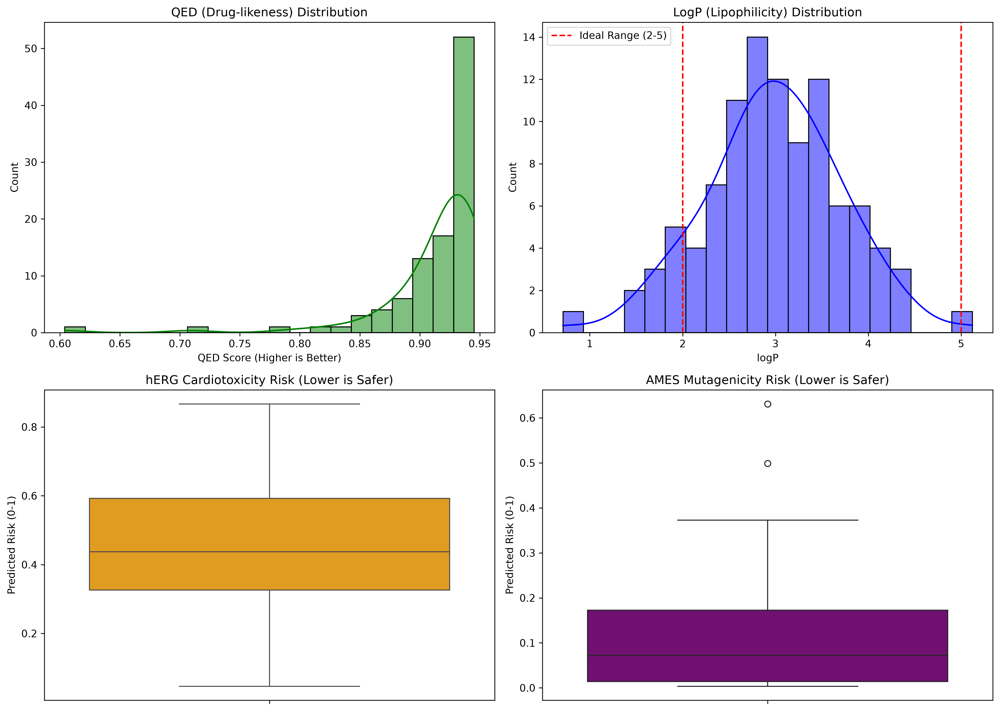

# 分子生成与 ADMET 性质预测

本项目展示了一个从**分子设计**到**药物安全性评估**的完整流程，通过强化学习生成全新分子，并利用 ADMET-AI 模型对其进行药代动力学和毒性评估，最终筛选出 100 个具有优越类药性的候选分子。

## 🧬 1. 分子是怎么生成的？
本项目的分子并非来自现有数据库，而是通过 **强化学习 (Reinforcement Learning, RL)** 全新生成的。

* **先验模型 (Prior)**：使用大量公开的类药分子预先训练好，掌握了分子“语法”。
* **打分函数 (Scoring)**：使用 QED（类药性评价）作为“裁判”。
* **强化学习过程**：模型（Agent）不断尝试“写”出新分子，裁判给出分数，高分者获得奖励。经过 10000 步的迭代优化，模型学会了生成高 QED 的全新分子。

## 🧪 2. ADMET 预测是怎么做的？
* **输入**：模型生成的 SMILES 字符串（分子结构）。
* **模型**：使用 **ADMET-AI**（底层基于 Chemprop 图神经网络）。
* **处理**：分子结构被转化为“图（Graph）”数据，模型通过原子间的信息传递，预测出该分子的 104 项 ADME（吸收、分布、代谢、排泄）和毒性（Tox）属性。

## 📊 3. 预测处理的数据分别是什么意思？
在 `random_100_admet_results.csv` 中，不同的列代表了不同类别的分子性质（**对于毒性类指标，数值越低越安全；对于类药性指标，数值越高越好**）：

| 指标类型 | 指标名称 | 含义说明 |
| :--- | :--- | :--- |
| **理化性质** | `logP`, `TPSA`, `MW` | 脂溶性、极性表面积、分子量（控制药物吸收的关键） |
| **类药性** | `QED`, `Lipinski` | 类药性综合评分（越高越好） |
| **吸收代谢** | `Caco2_Wang`, `Pgp`, `Bioavailability` | 肠渗透性、外排泵作用、生物利用度 |
| **核心毒性** | `hERG`, `AMES`, `DILI` | 心脏毒性、致突变性、肝毒性（**越低越安全**） |

## 📈 4. 预测性能可视化
以下两张图直观展示了这 100 个分子的性质分布（**大部分分子 QED 高度集中在 0.8 以上，且毒性风险处于极低水平，说明这批分子的成药性极其优秀**）。

**100个分子二维结构图（4x25）：**

**分子核心性质分布图：**

## 📁 文件结构
- `random_100_molecules.csv`：100 个分子的 SMILES 和 QED 打分。
- `random_100_admet_results.csv`：ADMET 模型预测的 104 项属性。
- `predict.py`：批量预测脚本。
- `generate_readme_table.py`：数据分析脚本。

---
*项目构建于 AutoDL 云端 GPU 环境，完成于 2026 年。*
